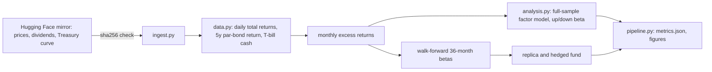
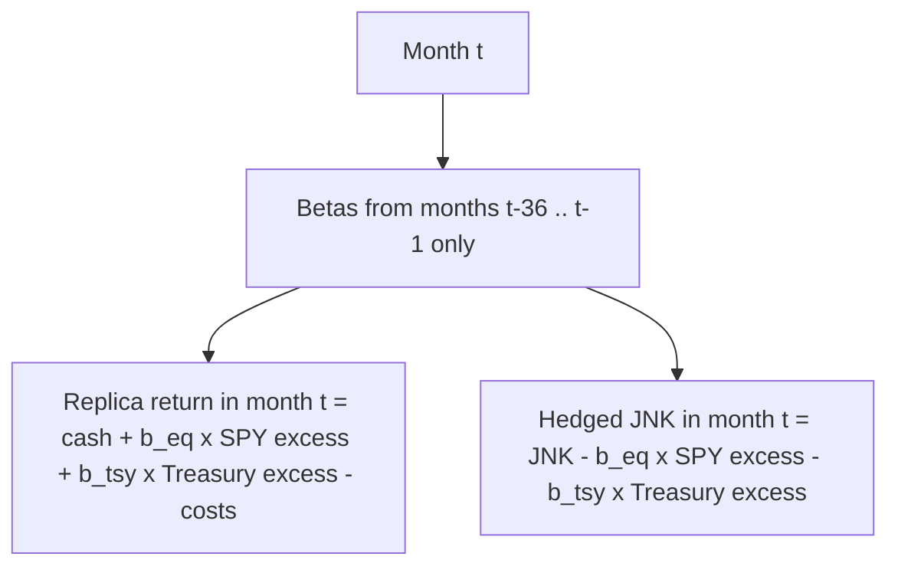

# Architecture

```mermaid
flowchart LR
  A[Hugging Face mirror: prices, dividends, Treasury curve] -->|sha256 check| B[ingest.py]
  B --> C[data.py: daily total returns, 5y par-bond return, T-bill cash]
  C --> D[monthly excess returns]
  D --> E[analysis.py: full-sample factor model, up/down beta]
  D --> F[walk-forward 36-month betas]
  F --> G[replica and hedged fund]
  E & G --> H[pipeline.py: metrics.json, figures]
```

```mermaid
flowchart TD
  M[Month t] --> W[Betas from months t-36 .. t-1 only]
  W --> R[Replica return in month t = cash + b_eq x SPY excess + b_tsy x Treasury excess - costs]
  W --> H[Hedged JNK in month t = JNK - b_eq x SPY excess - b_tsy x Treasury excess]
```

Modules: `ingest.py` (download and verify), `data.py` (returns), `analysis.py` (regressions, replica, tests), `figures.py`, `pipeline.py`. Tests: `tests/test_core.py`.
